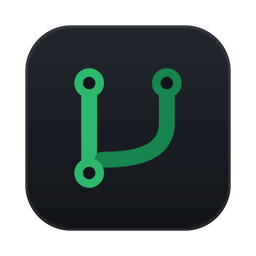

<p align="center">
  
</p>

<h1 align="center">GHBar</h1>

<p align="center">
  <strong>Pull requests and issues from your repositories, in the menu bar.</strong><br />
  The contributions people send you — without the rest of the notification inbox.
</p>

<p align="center">
  <a href="https://github.com/cobanov/ghbar/releases/latest"></a>
  
  
</p>

---

## Why

GitHub's notification inbox mixes everything together: a comment on your own PR,
a thread you subscribed to once, a CI result. The one signal that actually needs
you — *somebody sent a contribution to my repository* — gets lost in it.

GHBar shows only that signal, and keeps it in the menu bar.

---

## Download

**Homebrew**

```bash
brew install --cask cobanov/tap/ghbar
```

**Manual** — grab the latest zip from [**Releases**](https://github.com/cobanov/ghbar/releases/latest):

1. Download `GHBar-*-macos.zip`
2. Unzip and move **GHBar.app** to **Applications**
3. Open it

The app is signed with a Developer ID certificate and notarized by Apple, so it
opens without a Gatekeeper warning.

---

## Requirements

- **macOS 14** (Sonoma) or newer

That's it. GHBar signs in with GitHub's device flow — no account to create, no
password to hand over. If you already use the
[GitHub CLI](https://cli.github.com) (`gh`), GHBar picks its token up
automatically and you never see a sign-in screen at all.

---

## What you get

| | |
| --- | --- |
| **Only what's yours** | Pull requests and issues **other people** opened on your repositories, plus PRs waiting on your review |
| **Unread at a glance** | New items are green, seen ones fade — the count sits in the menu bar |
| **Noisy repo? Folded** | A repository with more than three open items collapses into one row instead of flooding the list |
| **Bots stay out** | Dependabot and friends are filtered by default |
| **Honest about failures** | If GHBar can't reach GitHub it says so, instead of showing an empty list you'd read as "nothing waiting" |
| **Costs one API point** | A single GraphQL query per refresh — 0.24% of your hourly quota at the default five-minute interval |

---

## How it works

One GraphQL request per refresh covers three searches, your profile and the
rate-limit status:

```
is:pr    is:open user:@me -author:@me     → Pull Requests
is:issue is:open user:@me -author:@me     → Issues
is:pr    is:open review-requested:@me     → Review Requested
```

Everything else is local: filtering, grouping and the record of what you've
already seen (`~/Library/Application Support/GHBar/seen.json`). GHBar has no
server, no telemetry and no network listener of its own.

Refreshes happen every five minutes, when you open the menu, when the Mac wakes
from sleep, and on ⌘R.

---

## Building from source

```bash
git clone https://github.com/cobanov/ghbar
cd ghbar
make install      # builds, bundles and installs to /Applications
```

`make test` runs the suite. `make release` signs, notarizes and packages —
that one needs a Developer ID certificate.

---

## License

MIT — see [LICENSE](LICENSE).
